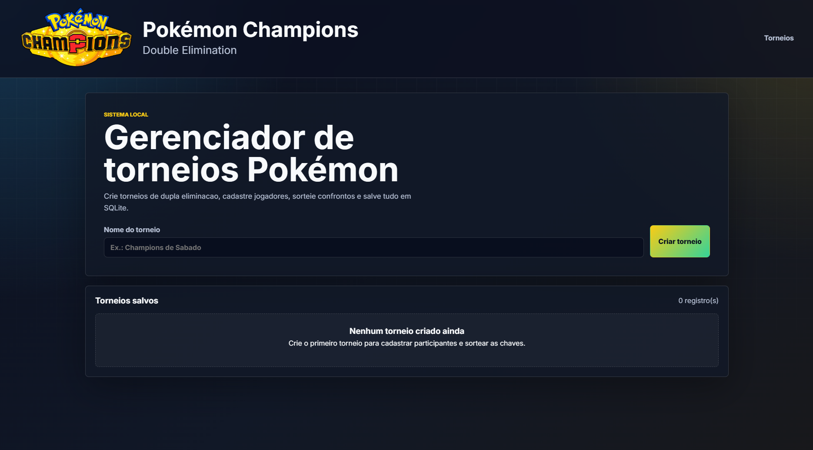

# 🏆 Pokémon Champions

Sistema local para gerenciamento de torneios de Pokémon no formato **dupla eliminação** (*Double Elimination*). A aplicação permite cadastrar participantes, sortear confrontos, registrar resultados, controlar chave principal e repescagem, além de definir automaticamente o pódio final.

## 🖥️ Tela do sistema



## 📌 Visão Geral

O projeto foi desenvolvido para organizar torneios presenciais de Pokémon com uma interface visual simples, bonita e funcional. A proposta é permitir que o organizador acompanhe o campeonato pelo navegador, mantendo os dados salvos localmente em banco SQLite.

Fluxo principal da aplicação:

- Criação de um torneio local.
- Cadastro dos participantes com nome, apelido e imagem.
- Sorteio aleatório dos confrontos iniciais.
- Registro do vencedor de cada partida.
- Envio automático do perdedor para a repescagem após a primeira derrota.
- Eliminação automática após a segunda derrota.
- Criação da grande final entre o campeão da chave principal e o campeão da repescagem.
- Definição do pódio com campeão, vice-campeão e terceiro lugar.

Por padrão, o sistema funciona localmente pelo navegador em `http://127.0.0.1:5000`, sem necessidade de hospedagem online.

## ✨ Funcionalidades

- 🎲 Sorteio aleatório dos confrontos iniciais.
- 🧑‍🤝‍🧑 Cadastro de participantes com imagem.
- 🏅 Controle da chave principal (*Upper/Winners Bracket*).
- 🔁 Controle da chave de repescagem (*Lower/Losers Bracket*).
- ✅ Registro de vencedores das partidas.
- ❌ Eliminação automática após duas derrotas.
- 👑 Grande final entre os campeões das duas chaves.
- 🥇 Definição automática de 1º, 2º e 3º lugares.
- 💾 Persistência local com SQLite.
- 🖥️ Inicialização por atalho no Windows.

## 🛠️ Tecnologias

- Python
- Flask
- SQLite
- HTML
- CSS
- JavaScript

## 🧱 Arquitetura

```text
Pokémon Champions/
├── app.py
├── banco.py
├── torneio_servico.py
├── requirements.txt
├── iniciar_sistema.bat
├── iniciar_oculto.vbs
├── Iniciar Pokémon Champions.lnk
├── templates
│   ├── base.html
│   ├── inicio.html
│   ├── participantes.html
│   └── torneio.html
└── static
    ├── css
    ├── js
    ├── uploads
    ├── favicon.ico
    ├── logo.png
    └── pokebola.png
```

Principais responsabilidades:

- `app.py`: configura o Flask, registra as rotas e conecta as telas com a lógica do sistema.
- `banco.py`: centraliza a conexão com o SQLite e a criação das tabelas.
- `torneio_servico.py`: concentra as regras de negócio da dupla eliminação.
- `templates`: armazena as páginas HTML renderizadas pelo Flask.
- `static`: concentra CSS, JavaScript, imagens e uploads dos participantes.

## ▶️ Como Executar

Pré-requisitos:

- Python instalado no computador.
- `pip` disponível no terminal.

Instale as dependências:

```bash
pip install -r requirements.txt
```

Execute a aplicação:

```bash
python app.py
```

Endereço local:

```text
http://127.0.0.1:5000
```

No Windows, também é possível iniciar pelo atalho:

```text
Iniciar Pokémon Champions.lnk
```

O atalho utiliza o arquivo `iniciar_oculto.vbs` para abrir o sistema sem manter uma janela de terminal visível.

## ⚔️ Regras da Dupla Eliminação

- Todos os participantes começam na chave principal.
- A primeira derrota move o participante para a chave de repescagem.
- A segunda derrota elimina o participante do torneio.
- A grande final ocorre entre o campeão da chave principal e o campeão da repescagem.
- O terceiro lugar corresponde ao perdedor da final da repescagem.

## 💾 Persistência Local

O sistema usa SQLite para salvar os dados do torneio localmente.

O banco é criado automaticamente na raiz do projeto:

```text
torneio.db
```

Esse arquivo não deve ser versionado, pois pode conter dados reais de torneios cadastrados. Por isso, ele está listado no `.gitignore`.

## ⚠️ Observação Sobre Ambiente Local

Este projeto foi pensado para execução local em torneios presenciais. A aplicação não depende de internet para funcionar depois que as dependências estão instaladas.

Para rodar em outro computador, instale o Python e marque a opção `Add Python to PATH` durante a instalação no Windows.

Arquivos locais como banco de dados, uploads de participantes, logs e cache do Python não devem ser enviados para o GitHub.

## 🧪 Status do Projeto

Projeto em desenvolvimento inicial.

Melhorias previstas:

- Melhorar a visualização gráfica das chaves.
- Adicionar edição de participantes.
- Criar rotina de backup e restauração.
- Exportar resultados finais do torneio.
- Refinar cenários avançados da grande final.
- Melhorar responsividade em telas menores.
